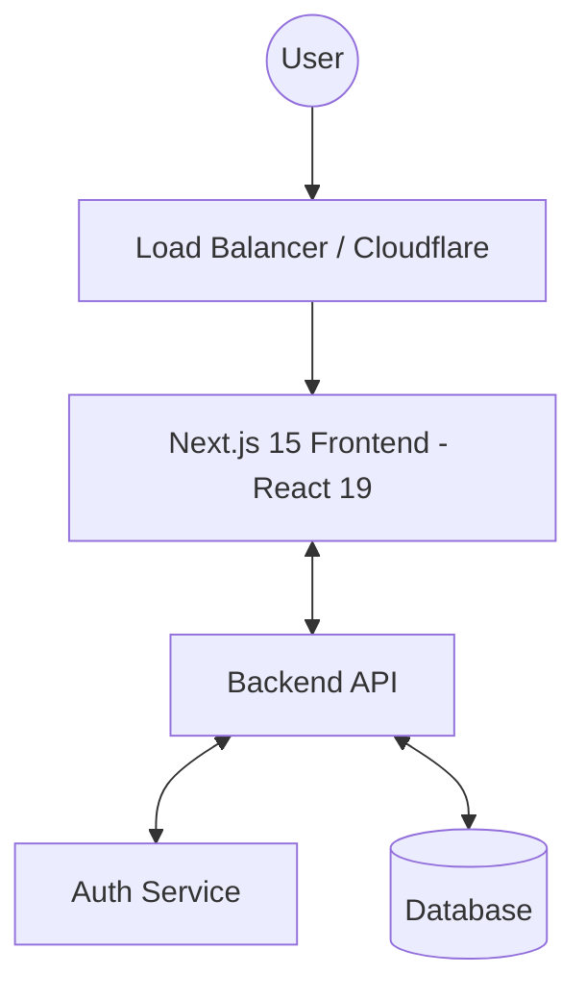

# System Architecture

## High-Level Architecture

## Routing Architecture
- **Framework**: Next.js 15 App Router with React 19.
- **Dynamic Routing**: `/[locale]/...` structure for i18n.
- **Middleware**: Intercepts every request (except static assets/API) to:
  1. Detect/set locale.
  2. Verify JWT tokens in cookies.
  3. Check route-level permissions against `PermissionMap`.
  4. Redirect to login or 403 pages as needed.

## Authentication & Authorization Flow
1. **Login**: User submits credentials -> Backend returns JWT tokens.
2. **Token Storage**: Access token and permissions stored in HTTP-only cookies (for SSR) and Zustand (for client-side UI).
3. **Authorization**:
   - **Route Level**: Managed by `middleware.ts`.
   - **Component Level**: Checked via permissions stored in `useUserStore`.
   - **API Level**: Tokens injected via Axios interceptors; backend validates every request.

## API Integration Architecture
- **Axios Layer**: Base instance with timeout, base URL, and auth interceptors.
- **Service Layer**: Functions returning Axios promises, organized by domain.
- **Hook Layer**: TanStack Query wrappers providing caching, revalidation, and loading states.

## State Management Architecture
- **Persistence**: Auth and user data persisted in cookies.
- **Reactivity**: Zustand handles immediate UI updates (e.g., sidebar toggle, navigation progress).
- **Cache**: TanStack Query manages the server-side data cache, ensuring data is stale-while-revalidate.
- **Form State**: Managed via `react-hook-form` with centralized logic in custom hooks (e.g., `useTourForm`) to bridge between API data and form inputs.

## Component Architecture Patterns

### Form Section Composition
To manage complexity in large administrative forms, we employ a "Section Composition" pattern:
1. **Parent Hook**: Centralizes `useForm` initialization, validation schemas, and default values.
2. **Unified Form Component**: Orchestrates the layout and handles submission logic.
3. **Atomic Sections**: Individual components (e.g., `TourBasicInfoSection`) that focus on a subset of the form fields, receiving the `form` instance via props. This allows for cleaner code and easier testing of specific form segments.

### Chatbot Architecture (Unified V2+V3)
The chatbot implements a hybrid architecture combining persistent session management with real-time AI interaction:
1. **Logic Orchestrator**: `use-chatbot.ts` hook centralizes all side effects:
   - Authentication: Injects `Bearer` token from `useAuthStore` into API headers.
   - Persistence: Syncs messages with `useChatSession` (Zustand + LocalStorage).
   - UI State: Manages window visibility, input values, and typing indicators.
2. **Presentation Layer**: A collection of atomic components (`ChatbotInput`, `ChatbotMessage`, etc.) that are strictly controlled by the hook's state.
3. **Context Awareness**: The `cache` object in `ChatRequest` allows the AI to maintain state about the user's current view (e.g., selected tour, booking details).

## Internationalization (i18n)
- **Library**: `next-intl`.
- **Strategy**: Prefixed routing (`/en/tours`, `/vi/tours`).
- **Translation**: JSON messages in `src/messages/`.
- **Navigation**: Custom `Link` and `useRouter` from `@/libs/i18n-navigation` to maintain locale state.

## Build & Deployment
- **Docker**: Multi-stage build (deps -> builder -> runner).
- **Output**: Standalone mode for optimized production deployment.
- **Environment**: Strict validation using `@t3-oss/env-nextjs`.

## Unresolved Questions
- Integration with external CDN for image optimization (Cloudflare/Vercel).
- Strategy for handling real-time notifications (WebSockets vs Polling).
